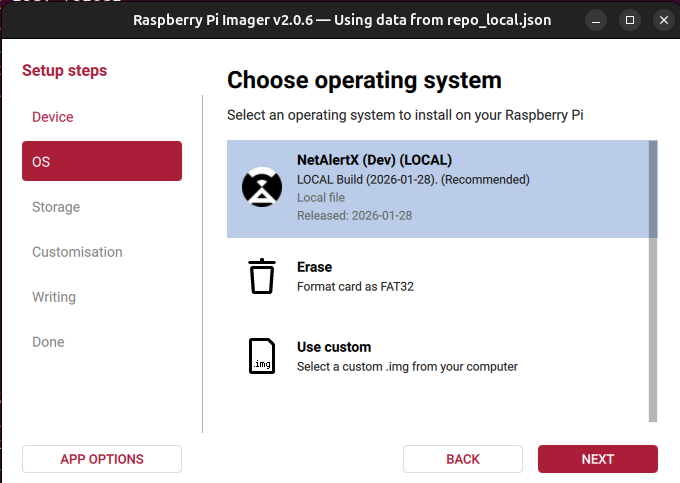

# NetAlertX Raspberry Pi Image

A fully automated, pre-configured Raspberry Pi OS image for [NetAlertX](https://netalertx.com/).


## 🌟 Features
*   **Ready-to-Flash Image:** A complete, pre-configured Raspberry Pi OS (64-bit Bookworm).
*   **Pre-installed NetAlertX:** Docker, Docker Compose, and NetAlertX are ready to go out of the box.
*   **Auto-Updating:** Hourly checks for newer NetAlertX versions. Just reboot to apply.
*   **Headless & Zero-Touch:** Fully supports Wi-Fi, SSH, and User customization via RPi Imager.
*   **Production & Dev Tracks:** Choose between stable releases or the latest development builds.
*   **Broad Hardware Support:** Compatible with Pi 5, Pi 4, Pi 3, and Pi Zero 2 W.
*   **Remote Management:** Supports [Raspberry Pi Connect](https://connect.raspberrypi.com/) for cloud-based status and terminal access.

---

## ⚡ Quick Start (Requires Imager v2+)

> [!IMPORTANT]  
> **This image requires [Raspberry Pi Imager v2+](https://www.raspberrypi.com/software/)**.  
> The older v1 style (with the gear icon) is deprecated and does not support the modern customization wizard required for this image. 

It should look like this:



### 1. Configure Repository
*   Open **Raspberry Pi Imager v2**.
*   Click **APP OPTIONS** (bottom left) -> **Content Repository**.
*   Paste the following URL and click **Save**:
    ```text
    https://raw.githubusercontent.com/netalertx/rpi-image/refs/heads/master/rpi-imager/repo.json
    ```

### 2. Wizard Setup
Click through the new **NEXT**-based wizard to configure:
*   **Device:** Select your Raspberry Pi model (e.g., Pi 4, Pi 5).
*   **Operating System:** Scroll to **NetAlertX** and select either **Production** or **Dev**.
*   **Storage:** Select your SD card or USB drive.
*   **Customisation:** (New Wizard Step) Set your **Hostname**, **WiFi**, **User**, **SSH**, and **Raspberry Pi Connect**.
*   **Write:** Review your summary and click **Write**.

---

## 🛠️ Management
*   **SSH Access:** `ssh <user>@<hostname>.local`
*   **Raspberry Pi Connect:** [Cloud-based remote access](https://connect.raspberrypi.com/) and status monitoring.
*   **Manual Update:** `sudo systemctl start netalertx-updater` then reboot.
*   **Logs:** `docker logs -f netalertx`

## 🏗️ Development
Build locally using VS Code Dev Containers:
1.  Run task: **Build RPi Image Locally (dev)**.
2.  In Imager: **APP OPTIONS** -> **Content Repository** -> select `netalertx-rpi-image-dev/repo_local.json`.

---
*Based on Raspberry Pi OS Lite (Bookworm) 64-bit.*